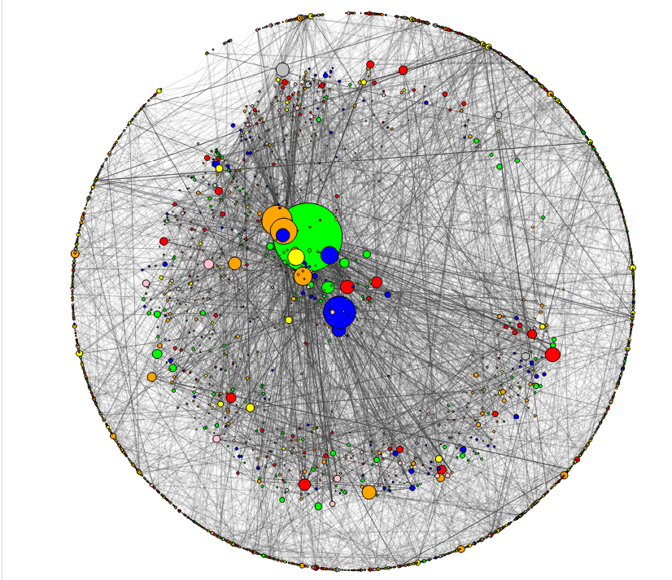
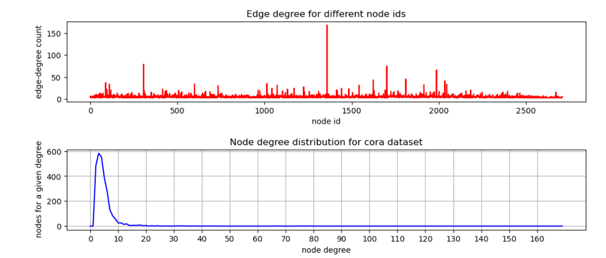

# :heart::computer:Grafovske neuronske mreže sa mehanizmom pažnje-GAT:computer::heart:

Ovaj repozitorijum sadrži PyTorch implementaciju dva originalna rada o Grafovskim neuronskim mrežama GAT ([Petar Veličković](https://arxiv.org/abs/1710.10903) i [Thomas N. Kipf](https://arxiv.org/abs/1609.02907)).  
`Projekat je rađen u sklopu kursa Mašinsko učenje na Matematičkom fakultetu, Univerziteta u Beogradu.`

Ovaj projekat ima za cilj da predstavi Grafovske neuronske mreže i pokaže primenu i kvalitet različitih modela korišćenih za klasifikaciju podataka na poznatom skupu <b>Cora</b>.

## Sadržaj

#### 1. Teorija

U ovom poglavlju uvodimo osnovne elemente teorije grafova, koji čine osnovu na kojoj se zasniva oblast Grafovskih neuronskih mreža sa mehanizmom pažnje. Pored toga objašnjen je koncept i struktura GAT-a kao neuronskih mreže koje rade sa podacima koji su predstavljeni i strukturirani grafom, koje koriste maskirane slojeve mehanizma pažnje kako bi unapredili i poboljšali nedostatke starijih algoritama koji su bili bazirani na grafovskim konvolutivnim mrežama.

#### 2. Upoznavanje sa podacima i vizualizacija

Skup podataka sa kojim radimo sadrži naučne radove iz različitih oblasti vezanih za Mašinsko učenje koji su klasifikovani u 7 kategorija. Tu spadaju:
* Reinforcement Learning
* Neural Networks
* Case Based
* Genetic Algorithms
* Probabilistic Methods
* Rule Learning
* Theory

U ovom skupu podataka čvorovi odgovaraju dokumentima, a ivice neusmerenim citatima između tih dokumenata.

Naredni grafici prikazuju vezu između čvorova i njihove povezanosti sa ostalim čvorovima (naučnim radovima). Zaključujemo da je većina čvorova povezana sa <50 drugih čvorova, dok ih je svega par povezano sa više.

